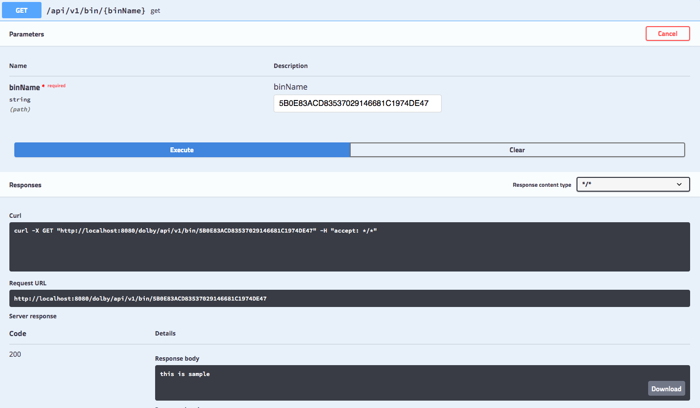

# Pastebin Microservice

## Project Requirement

Write a production ready microservice that illustrates pastebin.

1. Create a bin  
2. Get the bin value

## Proposed   Architecture
Following is my proposed system architecture for building Highy Available  and Scalable system by leveraging different public cloud service offerings   
 ( Infrastructure as a Service  - IAAS  and Software as Service - SAAS ) 

## Service  Architecture
Spring boot is used to develop the complete  micro service system, following is the high
level micro service acrchitecture of the services in the system.

## Health Monitoring Dashboard  ( Datadog , AWS )
 
<a href="https://p.datadoghq.com/sb/678ebe76-fb32-11eb-bb9e-da7ad0900002-bf1d0c86380c08372743e17c42d96c74?from_ts=1629185894725&to_ts=1629189494725&live=true" target="_blank">Adobe AEM Service Live Dash Board  - ( Click Here )</a>

 
 

## API Spec 
Once you run the application you can access the swagger API-spec at
http://localhost:8080/dolby/swagger-ui.html#/pastebin-controller/getUsingGET

### Create bin 

### Get bin value

## Build the application 
mvn clean install 

### Run the application
DolbyPastebinApplication
